# devops-netology

Склонировал удаленный репозиторий локально

## Игнорируемые файлы

При помощи файла .gitignore в terraform будут игнорироваться все файлы в названии который присутствует: .tfstate, crash.log, .tfvars, _override.tf, .terraformrc, .terraform.tfstate.lock.info

## Промежуточные итоги

Промежуточное состояния файлов в скриншотах:

Регистрация
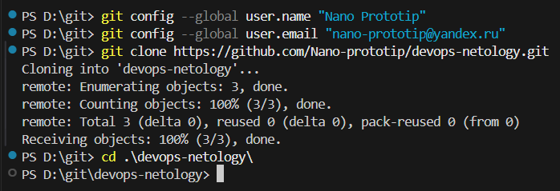

Статус
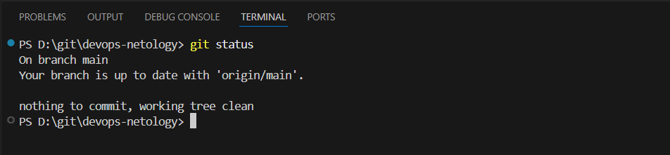

Статус после изменений
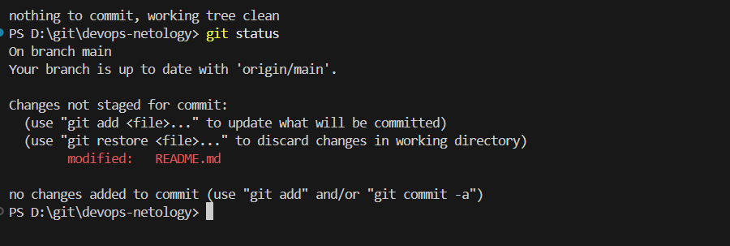

Изменения в git diff и git dif --staged
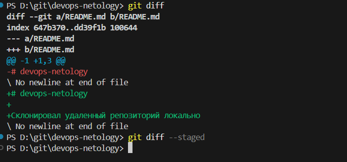
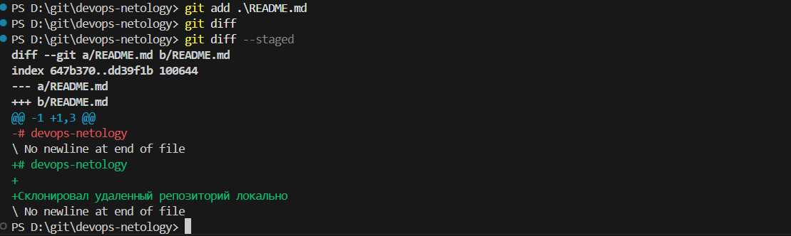
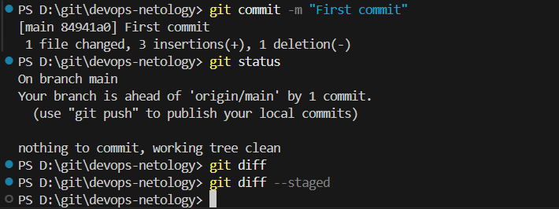

Добавление .gitignore
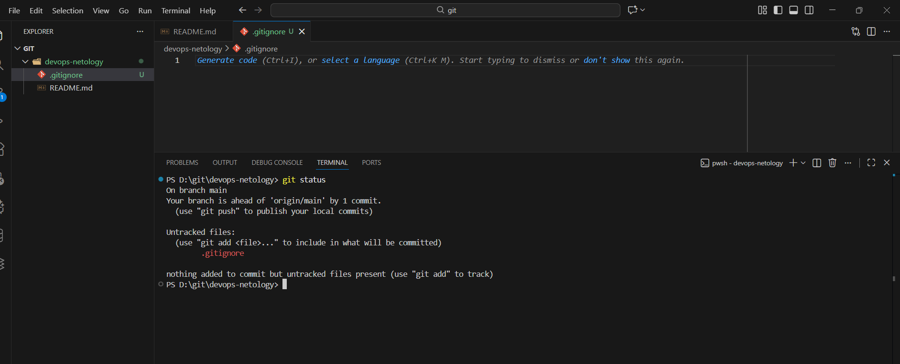

Добавление terraform
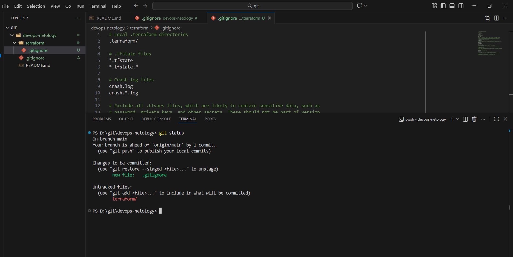
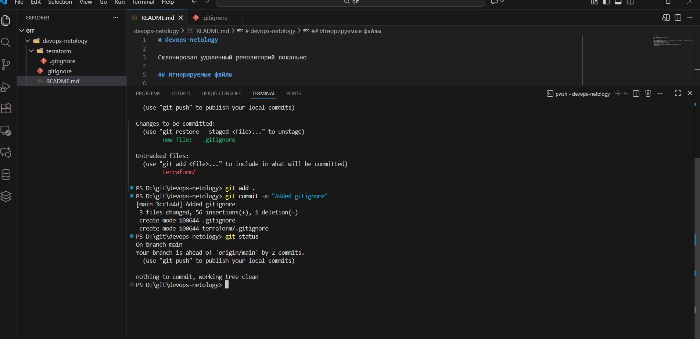

Добавление файлов will_be_deleted.txt и will_be_moved.txt
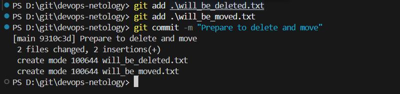

Удаление и перемещение файлов
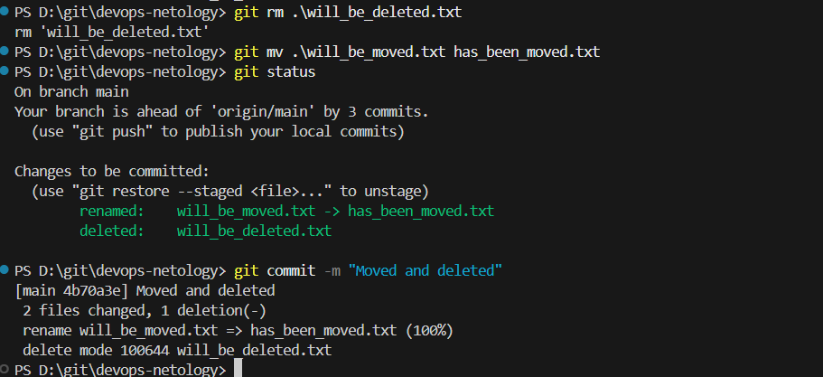

Результат работы в git log
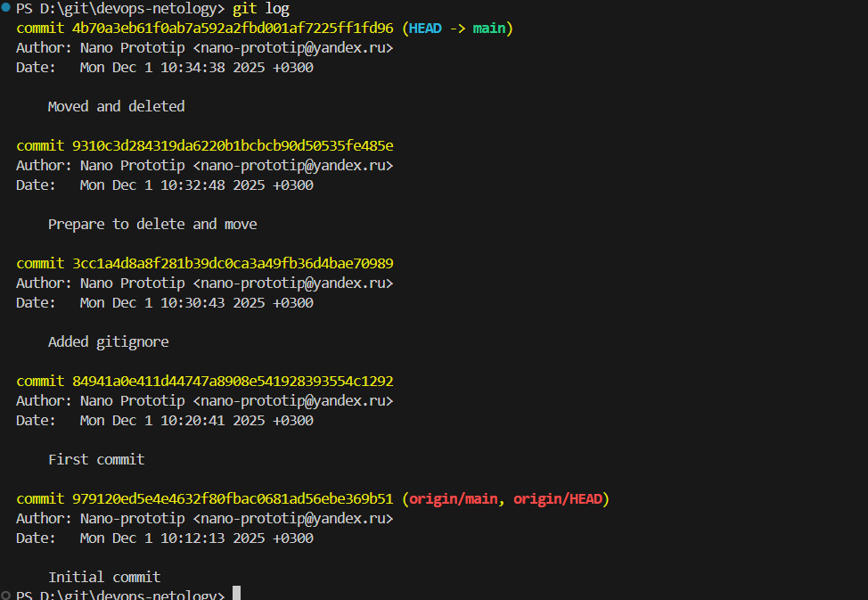
